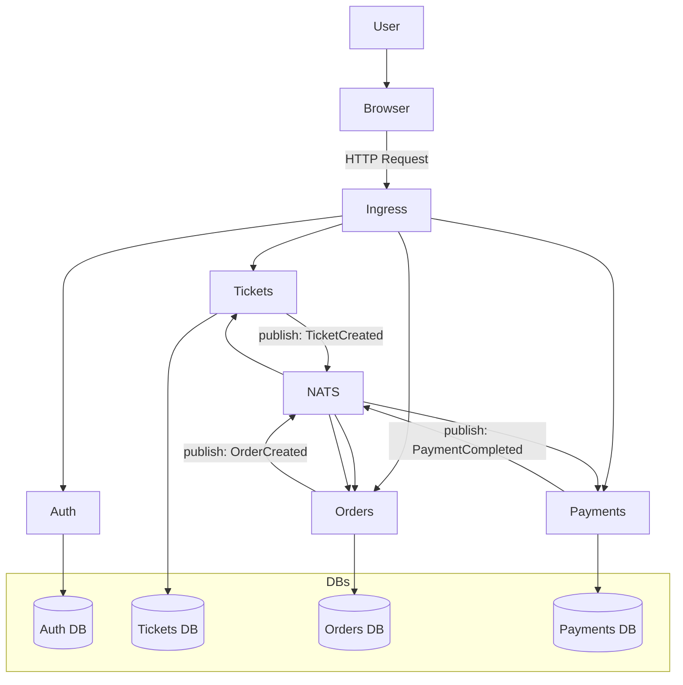
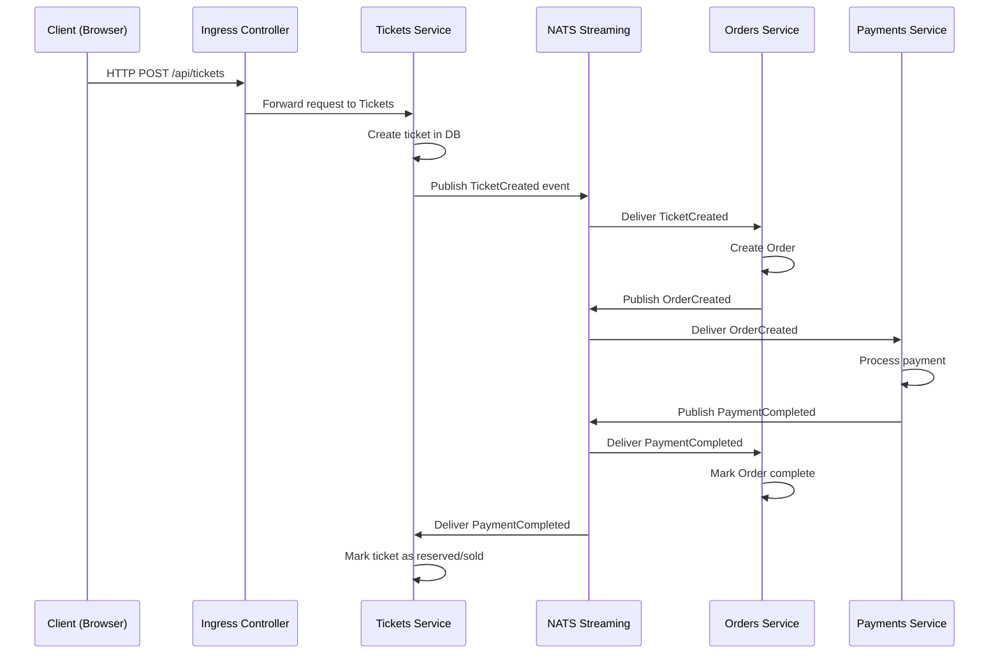

#  Tickets — Microservices 

### *Event-Driven Microservices with Node.js, TypeScript, NATS, Kubernetes & Next.js*

<p align="center">
  <a href="#"></a>
  <a href="#"></a>
  <a href="#"></a>
  <a href="#"></a>
  <a href="#"></a>
  <a href="#"></a>
  <a href="#"></a>
</p>

<p align="center">
  A clean, production-style microservices architecture for learning **distributed systems**,  
  **event-driven design**, **NATS Streaming**, and **Kubernetes development workflows**.
</p>

---

#  **Tech Stack**

<p align="center">
  &nbsp;&nbsp;
  &nbsp;&nbsp;
  &nbsp;&nbsp;
  &nbsp;&nbsp;
  &nbsp;&nbsp;
</p>

---

#  **Services Included**

```
.
├── auth/        → JWT authentication
├── tickets/     → Ticket creation & management
├── orders/      → Ticket reservation workflow
├── payments/    → Payment confirmation workflow
├── client/      → Next.js frontend
├── common/      → Shared utilities & event definitions
├── nats/        → Examples + test utilities
├── infra/       → Kubernetes manifests + Skaffold
└── diagrams/    → Architecture & flow diagrams
```

---

#  **Service-to-Service Flow (Click to Expand)**

<details>
<summary><strong>View System Flow</strong></summary>

###  **High-Level Service Flow**



**Flow Summary:**

* User creates a ticket → `TicketCreated` event published
* Orders service listens → creates order → emits `OrderCreated`
* Payments service listens → processes payment → emits `PaymentCompleted`
* Tickets & Orders update state accordingly
* Entire system stays **eventually consistent**

</details>

---

#  **Sequence Diagram — How Events Work**



---

#  **Quick Start**

### 1️ Start Infra

```bash
docker run --rm -p 4222:4222 -p 8222:8222 nats:2.10.0
docker run --rm -p 27017:27017 mongo:latest
```

### 2️ Run a service

```bash
cd auth
npm install
npm run dev
```

---

#  **Docker**

```bash
cd tickets
docker build -t tickets-tickets:local .
docker run --rm -p 3000:3000 tickets-tickets:local
```

---

#  **Kubernetes + Skaffold**

```bash
skaffold dev
```

* Auto rebuild
* Auto deploy
* Auto sync changes

Default host: **ticketforge.local**

---

#  **Environment Variables**

Example:

```
PORT=3000
JWT_KEY=your_jwt_secret
MONGO_URI=mongodb://localhost:27017/authdb
NATS_URL=nats://localhost:4222
```

---

#  **Testing**

```bash
npm test
```

Uses:

* Jest
* Supertest
* `mongodb-memory-server`


---

#  **Contributing**

* Fork → Branch → Commit → PR
* Add tests for each change
* Update `.env.example` when new config is added

---

#  **License**

MIT License

